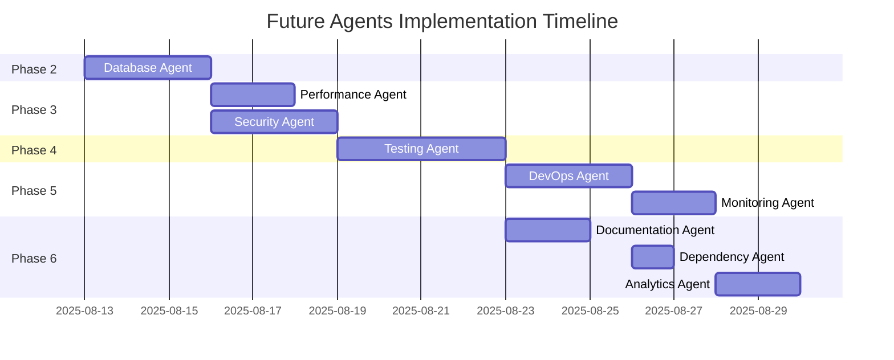

# 🔮 Future Agents - Planned Development Phases

## 🎯 Overview

This document outlines the planned future agents for completing the MTG Investment Next.js application modernization. Each agent builds upon the foundation established by the completed agents (TypeScript, Frontend, Backend, and Cleanup).

## 📋 Agent Development Roadmap

### **Phase 2: Core Infrastructure** (Next Priority)

#### **🗄️ Database Agent**
- **Purpose**: Replace file-based storage with proper database
- **Priority**: **High** (Next to implement)
- **Dependencies**: Backend Agent (configuration utilities)
- **Estimated Duration**: 2-3 hours

**Scope & Objectives**:
- Replace JSON file storage with SQLite/PostgreSQL
- Create data migration utilities  
- Implement connection pooling and query optimization
- Add database backup and restore capabilities
- Establish ORM integration (Prisma recommended)

**Key Deliverables**:
- Database schema design
- Migration scripts
- Database utility library
- Connection management
- Data access layer

**Technical Approach**:
```typescript
// Database configuration
const DATABASE_CONFIG = {
  development: 'sqlite:./data/mtg-investment.db',
  production: process.env.DATABASE_URL,
  pool: { min: 2, max: 10 }
};

// Migration example
interface PriceSnapshot {
  id: string;
  date: string;
  cards: ProcessedCardPrice[];
  created_at: Date;
}
```

---

### **Phase 3: Optimization & Performance**

#### **⚡ Performance Agent**
- **Purpose**: Optimize application performance and user experience
- **Priority**: **Medium-High**
- **Dependencies**: Database Agent, Frontend Agent
- **Estimated Duration**: 2 hours

**Scope & Objectives**:
- Implement Redis caching for MTGJSON data
- Add API response compression and CDN integration
- Optimize bundle sizes and implement code splitting
- Add lazy loading for card images and components
- Implement virtual scrolling for large card lists

**Key Deliverables**:
- Caching layer implementation
- Bundle optimization configuration
- Image lazy loading system
- Performance monitoring setup
- Load testing suite

**Technical Approach**:
```typescript
// Caching strategy
const CACHE_CONFIG = {
  redis: process.env.REDIS_URL,
  ttl: {
    mtgjson: 24 * 60 * 60, // 24 hours
    prices: 60 * 60,       // 1 hour
    search: 5 * 60         // 5 minutes
  }
};

// Virtual scrolling
<VirtualizedCardGrid
  itemCount={filteredCards.length}
  itemSize={200}
  renderItem={CardComponent}
/>
```

#### **🔒 Security Agent**
- **Purpose**: Add authentication, authorization, and security hardening
- **Priority**: **Medium-High**
- **Dependencies**: Database Agent, Backend Agent
- **Estimated Duration**: 2-3 hours

**Scope & Objectives**:
- Implement JWT-based authentication
- Add role-based access control (RBAC)
- Secure admin endpoints with proper authorization
- Add rate limiting and DDoS protection
- Implement input validation and sanitization

**Key Deliverables**:
- Authentication system
- Authorization middleware
- Security headers configuration
- Rate limiting implementation
- Input validation library

**Technical Approach**:
```typescript
// Authentication flow
const authConfig = {
  jwt: {
    secret: process.env.JWT_SECRET,
    expiresIn: '24h'
  },
  providers: ['email', 'google', 'github'],
  roles: ['user', 'admin', 'moderator']
};

// Secure route wrapper
export const secureRoute = (handler, requiredRole = 'user') => {
  return withAuth(withRateLimit(handler), requiredRole);
};
```

---

### **Phase 4: Quality Assurance**

#### **🧪 Testing Agent**
- **Purpose**: Comprehensive test coverage across all application layers
- **Priority**: **Medium**
- **Dependencies**: All previous agents
- **Estimated Duration**: 3-4 hours

**Scope & Objectives**:
- Unit tests for utilities and components (Jest/Vitest)
- Integration tests for API endpoints (Supertest)
- End-to-end tests for critical user flows (Playwright)
- Component testing with React Testing Library
- Performance testing and load testing

**Key Deliverables**:
- Complete test suite (80%+ coverage)
- CI/CD test automation
- Performance benchmarks
- Test documentation and guidelines
- Mock data and test utilities

**Technical Approach**:
```typescript
// Test structure
tests/
├── unit/           # Component and utility tests
├── integration/    # API endpoint tests
├── e2e/           # End-to-end user flows
├── fixtures/      # Test data and mocks
└── utils/         # Test utilities

// Example test
describe('CardFilters', () => {
  it('filters cards by price range', () => {
    render(<CardFilters {...props} />);
    // Test implementation
  });
});
```

---

### **Phase 5: Deployment & Operations**

#### **🚀 DevOps Agent**
- **Purpose**: Production deployment pipeline and infrastructure
- **Priority**: **Medium**
- **Dependencies**: Testing Agent
- **Estimated Duration**: 2-3 hours

**Scope & Objectives**:
- Docker containerization with multi-stage builds
- GitHub Actions CI/CD pipeline
- Production environment configuration
- Database migration automation
- Monitoring and logging setup

**Key Deliverables**:
- Dockerfile and docker-compose configuration
- CI/CD pipeline with automated testing
- Production deployment scripts
- Environment configuration management
- Monitoring and alerting setup

**Technical Approach**:
```dockerfile
# Multi-stage Docker build
FROM node:18-alpine AS builder
WORKDIR /app
COPY package*.json ./
RUN npm ci --only=production

FROM node:18-alpine AS runner
WORKDIR /app
COPY --from=builder /app/node_modules ./node_modules
COPY . .
EXPOSE 3000
CMD ["npm", "start"]
```

#### **📊 Monitoring Agent**
- **Purpose**: Application observability and performance monitoring
- **Priority**: **Low-Medium**
- **Dependencies**: DevOps Agent
- **Estimated Duration**: 2 hours

**Scope & Objectives**:
- Application performance monitoring (APM)
- Error tracking and alerting
- User analytics and behavior tracking
- Database performance monitoring
- Real-time dashboard creation

**Key Deliverables**:
- APM integration (Sentry, DataDog, or similar)
- Custom metrics and dashboards
- Error tracking and alerting
- Performance monitoring setup
- Analytics implementation

---

### **Phase 6: Advanced Features**

#### **📚 Documentation Agent**
- **Purpose**: Automated API documentation and developer guides
- **Priority**: **Low**
- **Dependencies**: Testing Agent
- **Estimated Duration**: 1-2 hours

**Scope & Objectives**:
- Auto-generate API documentation from OpenAPI specs
- Create component documentation with Storybook
- Generate database schema documentation
- Create deployment and maintenance guides
- Implement inline code documentation

#### **🔄 Dependency Agent**
- **Purpose**: Automated dependency management and security
- **Priority**: **Low**
- **Dependencies**: DevOps Agent
- **Estimated Duration**: 1 hour

**Scope & Objectives**:
- Automated dependency updates with Dependabot
- Security vulnerability scanning
- License compliance checking
- Bundle size analysis and optimization
- Dependency audit automation

#### **📈 Analytics Agent**
- **Purpose**: User behavior tracking and business intelligence
- **Priority**: **Low**
- **Dependencies**: Monitoring Agent
- **Estimated Duration**: 2 hours

**Scope & Objectives**:
- User behavior analytics
- Card collection insights
- Price trend analysis
- Custom business metrics
- Reporting and visualization

---

## 🗓️ Implementation Timeline

### **Recommended Sequence**


### **Priority Matrix**
| Agent | Business Value | Technical Complexity | Implementation Priority |
|-------|---------------|---------------------|------------------------|
| **Database Agent** | High | Medium | 🔴 **Critical** |
| **Performance Agent** | High | Medium | 🟡 **High** |
| **Security Agent** | High | High | 🟡 **High** |
| **Testing Agent** | Medium | Medium | 🟡 **High** |
| **DevOps Agent** | Medium | High | 🟢 **Medium** |
| **Monitoring Agent** | Medium | Low | 🟢 **Medium** |
| **Documentation Agent** | Low | Low | 🔵 **Low** |
| **Dependency Agent** | Low | Low | 🔵 **Low** |
| **Analytics Agent** | Low | Medium | 🔵 **Low** |

## 🛠️ Agent Implementation Templates

### **Agent Development Checklist**
```markdown
## Pre-Implementation
- [ ] Review dependencies and prerequisites
- [ ] Study existing codebase and patterns
- [ ] Define clear success criteria
- [ ] Plan integration with existing utilities

## Implementation
- [ ] Create agent-specific documentation
- [ ] Implement core functionality
- [ ] Add comprehensive error handling
- [ ] Write unit tests for new components
- [ ] Update integration tests

## Validation
- [ ] Run all existing tests
- [ ] Perform manual testing
- [ ] Validate performance impact
- [ ] Review security implications
- [ ] Test cleanup agent integration

## Handoff
- [ ] Document new capabilities for next agent
- [ ] Update architecture documentation
- [ ] Run cleanup agent
- [ ] Update progress tracking
- [ ] Generate completion report
```

### **Standard Agent Structure**
```typescript
class [AgentName]Agent {
  constructor(config: AgentConfig) {
    this.config = config;
    this.logger = new Logger(`${AgentName}Agent`);
    this.validator = new ResultValidator();
  }

  async execute(): Promise<AgentResults> {
    this.logger.start();
    
    try {
      await this.validatePrerequisites();
      const results = await this.performWork();
      await this.validateResults(results);
      await this.prepareHandoff(results);
      
      this.logger.success('Agent completed successfully');
      return results;
    } catch (error) {
      this.logger.error('Agent failed', error);
      await this.cleanup();
      throw error;
    }
  }

  private async validatePrerequisites(): Promise<void> {
    // Verify required previous agents completed
    // Check environment and dependencies
  }

  private async performWork(): Promise<WorkResults> {
    // Agent-specific implementation
  }

  private async validateResults(results: WorkResults): Promise<void> {
    // Verify successful completion
    // Run integration tests
  }

  private async prepareHandoff(results: WorkResults): Promise<void> {
    // Update documentation
    // Prepare artifacts for next agent
  }

  private async cleanup(): Promise<void> {
    // Run cleanup agent for this agent type
    // Remove temporary files
  }
}
```

## 📊 Success Metrics

### **Completion Criteria**
Each agent must meet these criteria:
- ✅ **Functionality**: All features working as designed
- ✅ **Quality**: Zero critical bugs, comprehensive testing
- ✅ **Performance**: No regression in application performance  
- ✅ **Security**: No new security vulnerabilities introduced
- ✅ **Documentation**: Complete documentation and handoff notes
- ✅ **Integration**: Seamless integration with existing components

### **Project Completion Metrics**
When all agents are complete:
- **Performance**: < 2s initial load time, < 500ms API responses
- **Security**: Zero high/critical security vulnerabilities
- **Test Coverage**: > 80% code coverage across all layers
- **Documentation**: Complete API docs, deployment guides, user documentation
- **Maintainability**: Well-organized codebase with clear patterns
- **Scalability**: Ready for production load with proper monitoring

## 🔄 Cleanup Integration

Each future agent will integrate with the cleanup system:

```javascript
// Agent-specific cleanup configuration will be added
const agentCleanupTasks = {
  "database-agent": {
    patterns: [
      "**/migrations/*-backup.*",
      "**/schema/*-old.*",
      "**/seeds/dev-*.*"
    ],
    customTasks: [
      "Remove test database connections",
      "Clean up development seed data"
    ]
  },
  // ... other agents
};
```

## 📚 Documentation Plan

Each agent will produce:
1. **Agent Documentation** - Implementation details and technical approach
2. **API Documentation** - New endpoints and capabilities added
3. **User Guide Updates** - How new features affect end users
4. **Architecture Updates** - Changes to system architecture
5. **Deployment Notes** - Production deployment considerations

---

*This roadmap represents a comprehensive plan for completing the MTG Investment application modernization. Each agent builds upon previous work while maintaining the established patterns and quality standards.*
